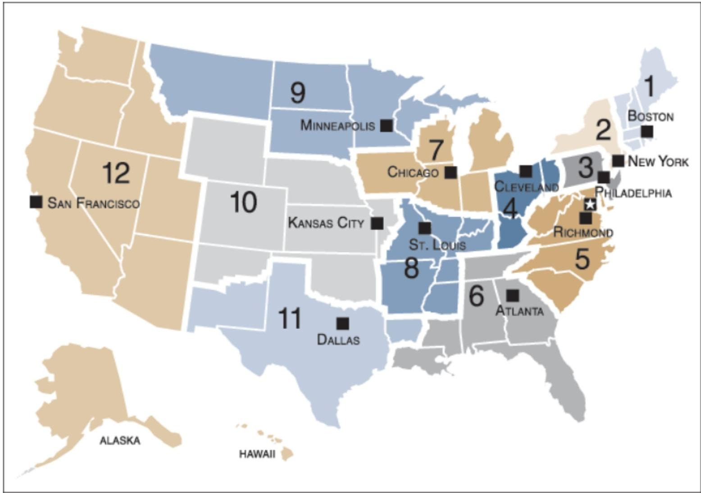

## Legal Mandate
- The Fed
Currently, the most important legislation is the Federal Reserve Act, which has been updated at various times. At present, this Act requires the Fed to meet a number of objectives including:
    1. A high level of employment.
    2. Stable prices (i.e. low inflation).
    3. Moderate long-term interest rates.
- The ECB
The legal basis for the single monetary policy of the Euro area was set in the 1993 Maastricht Treaty.

Unlike the Fed, the Eurosystem has a clear primary goal. The Treaty states: “the primary objective ... shall be to maintain price stability.” The Treaty then states that the Eurosystem “without prejudice to the objective of price stability ... shall support the general economic policies in the Community with a view to contributing to the achievement of the objectives ... laid down in Article 2.”

Article 2 mentions as objectives “a high level of employment, sustainable and noninflationary growth, a high degree of competitiveness and convergence of economic performance.”

## Organisation
- The Fed
    Need to distinguish the Federal Reserve System from the Federal Open Market Committee (FOMC) which makes the monetary policy decisions.

    

    The System consist of a central management board in Washington (the Board of Governors) and 12 regional Federal Reserve Banks. The System consist of a central management board in Washington (the Board of Governors) and 12 regional Federal Reserve Banks.

    While the FOMC consists of 12 members: The 7 members of the Board of Governors, the President of the New York Fed, and four other regional district Bank presidents, who sit on the committee on a rotating basis.
- The ECB
    The ECB is run by its six-member Executive Board. Monetary policy decisions are taken by the Governing Council of the ECB, comprising the Executive Board and the Governors of each of the (currently 19) participating national central banks (NCBs). So the Governing Council has 25 members.

## Banking Supervison
The U.S. has a highly complex system of banking regulation and supervision. The Fed directly supervises large bank holding companies, other national banks are supervised by the Office of the Comptroller of the Currency in the U.S. Treasury Department, while smaller state-chartered banks are supervised by the Federal Deposit Insurance Corporation (FDIC).

Euro area member states have historically differed in how they have handled banking supervision. Some have had national central banks perform this task while some have had separate agencies. 

In June 2012, the euro area heads of state agreed to allow the common “bailout fund” the European Stabilisation Mechanism, to make investments in under-capitalised European banks. As a condition for this agreement, it was decided that the ECB would become the “single supervisory mechanism” (SSM) for banks in the euro area.

The ECB took on this role in late 2014 and is currently directly supervising 119 banks, representing over 80% of all bank assets in the euro area. Other banks will continue to be supervised by the national authorities but the ECB can decide at any time to exercise direct supervision of any one of these credit institutions in order to ensure consistent application of supervisory standards.
## Independence
Recall that high inflation often stems from central banks being pressurised by governments to print money to finance budget deficits. The European Central Bank was set up with safeguards designed to prevent it from financing deficits. 

However, there is nothing preventing the ECB or Eurosystem NCBs from purchasing bonds of euro area governments in the secondary market (i.e. from other investors) as the ECB has done with its “Asset Purchase Programme”, i.e. its QE programme.

The Fed is also prohibited from direct purchases of Treasury bonds but has engaged in large-scale purchases of these bonds on secondary markets in its QE programme.
### The Fed
The Fed’s decisions are not subject to Congressional approval or Presidential veto, so in this sense it is politically independent. However, its legal mandates could be changed at any time by Congress and members of the FOMC are appointed by the President.

The Chairman of the Board—while serving a 14-year term as Governor—is subject to presidential re-appointment every four years, which needs to pass the House and Senate. The Humphrey-Hawkins act requires the Fed to deliver a bi-annual report to Congress including forecasts for output and inflation. After this report, the Chairman also needs to testify before Senate and Congressional committees and answer questions.

By current international standards, the Fed is not very independent.
### The ECB
The ECB is a highly independent central bank.

Its legal mandate is set by the Maastricht Treaty and would be almost impossible to change. The Maastricht Treaty forbids politicians in member countries from seeking to influence decisions of ECB.

ECB must prepare an annual report for the European parliament and the President appears four times a year at its Committee on Economic and Monetary Affairs.