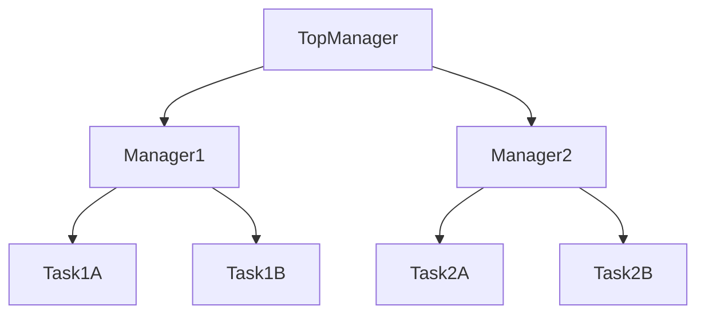
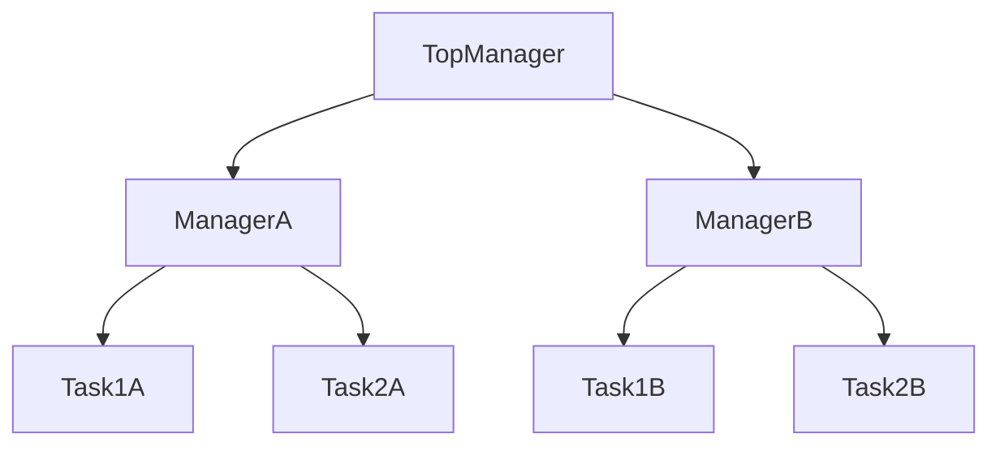
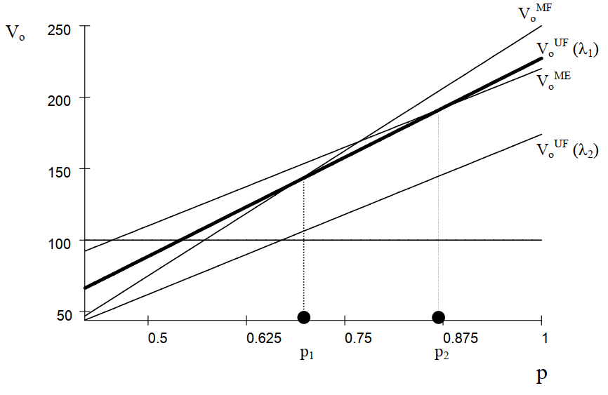

I get inspirations from another article [*Coordinating Tasks in M-Form and U-Form Organisations*](https://sticerd.lse.ac.uk/dps/te/te458.pdf) when I joined the Macroeconomics seminar in Renmin University. This is the [slide](M&U-form.pdf) that I used in that seminar. 

{}
** Below are just some of the key points in my thesis. 
{}

## History Background

  The fiscal system of the Qing Dynasty in the early period and the late period showed a very different face. 
  
  The fiscal system of the early Qing Dynasty was characterized by "centralized power" and "low taxes", which together with the bureaucratic group selected by the imperial examination system and the local "politics of virtue" formed the ancient Chinese national governance system.  Under this system, the population of the Qing Dynasty grew substantially and the economy gradually recovered. 
  
  However, the massive population growth also brought great pressure on social governance, and the rigid financial system gradually failed to adapt to the needs of society and disintegrated. After the outbreak of the Taiping Heavenly Kingdom Movement in the second half of the 19th century, the local governance gradually show up. The fiscal system of "decentralization" and "high taxes" began to be established. 

## Innovation  
  
  Most of the established views were critical of this change, arguing that decentralization hindered the establishment of a unified tax system throughout the country and slowed down economic development. 
  
  In this paper, we borrow the "M-form" and "U-form" of economic organization to portray the two fiscal systems of the former Qing Dynasty and the late Qing Dynasty, and construct a model to compare the two systems. 
  
  The paper argues that in the late Qing, where official corruption and information asymmetry were serious, this decentralized system was conducive to leveraging local information advantages and stimulating social innovation. Fiscal decentralization was also more flexible, allowing localities to explore reform options on their own, making an important contribution to China's modernization.

Suppose we have two regions A and B, each region needs to handle task1 and task2.

- M form: each region has a manager(horizontal), leveraging information asymmetry  
- U form each section has a manager(vertical), scale economy

Figure 1: U-form

Figure 2: M-form

## Mathematical Model

Two parameters: $p$ is the quality of the reform while $\lambda$ is about information flow.

### Two sectors, Two regions
  - No Reform
  
  - Full Scale Reform
    
    - $V_0^{MF}$  M form with full scale reform
  
    - $V_0^{UF}$  U form with full scale reform
  
  - Reform with Experienment
  
    - $V_0^{ME}$  M form with experienment

Figure 3: Comparison between M-from and U-from

**Conclusion:**

(1) the U-form is better for carrying out reforms and yields a higher net present value when the quality of communication $\lambda$ is high;

(2) the M-form is better for carrying out reforms when the quality of communication $\lambda$ is low; and the M-form with experimentation yields a higher net present value than either the U-form or the M-form without experimentation if in addition the uncertainty of reform blueprint $p < p^{*}$. 

### Generalization( M sectors, N regions)
**Conclusion:**

(1) The U-form has a larger positive effect from the increase in the number of regions than the M-form.

(2) The U-form also has a larger negative effect from the increase in the the number of funcitons than the M-form. 
 
